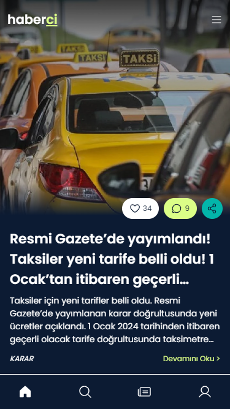
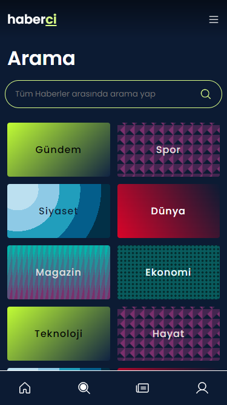

# Haberci - News App
This project is another personal project that uses Haberler API from [collectAPI.com](https://collectapi.com/tr/api/news/haberler-api). The project started with a home page design on Figma. I wondered how it would be if news websites started to use TikTok-like feeds. With the design impressing me, I had to create it.

## Table of contents

- [Overview](#overview)
  - [The challenge](#the-challenge)
  - [Screenshot](#screenshot)
  - [Links](#links)
- [My process](#my-process)
  - [Built with](#built-with)
  - [What I learned](#what-i-learned)
  - [Useful resources](#useful-resources)
- [Author](#author)

## Overview

### The challenge

Users should be able to:

- See the size of the elements adjust based on their device's screen size
- See the latest news that are being pulled from the API
- Travel through pages without any problem

### Screenshot

### Links

- Live Site URL: [haberci.netlify.app](https://haberci.netlify.app)

## My process

### Built with

- [React](https://reactjs.org/) - JS library
- [React Router](https://reactrouter.com/en/main) - React framework for routing
- [React Icons](https://react-icons.github.io/react-icons/)
- [React Redux](https://react-redux.js.org)
- [Google Fonts](https://fonts.google.com)
- [Haberler API](https://collectapi.com/tr/api/news/haberler-api)
- [axios](https://axios-http.com)
- Semantic HTML5 markup
- Flexbox
- CSS Grid
- Mobile-first workflow

### What I learned

This project is my first time using a ".env" file to store my API key. Using it with React JS and Netlify is a thing I learned from this project.
Also, creating cool shapes on the search page using gradients and background-size was cool. How they turned out made my day :)

### Useful resources

- [Using .env file in React js](https://medium.com/how-to-react/using-env-file-in-react-js-b2714235e77e) - This article really helped me with .env file.

## Author

- Github - [doganfurkan](https://github.com/doganfurkan)
- Frontend Mentor - [@doganfurkan](https://www.frontendmentor.io/profile/doganfurkan)
- Instagram - [@1furkandogan1](https://www.instagram.com/1furkandogan1)
